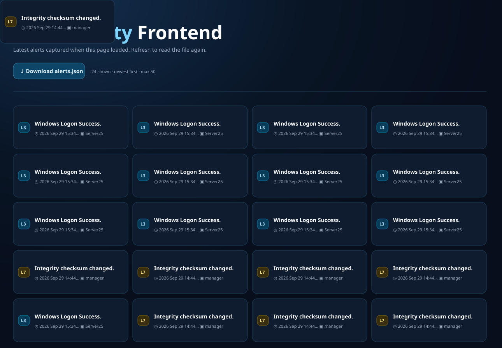

# Vox

Vox is a lightweight, read-only frontend for an OSSEC manager. It reads OSSEC's
newline-delimited `alerts.json`, shows the 50 newest alerts as a responsive card
grid, and lets an operator inspect or download the raw alert data. The layout is
suitable for phones and desktop browsers.



## Requirements

- An OSSEC manager writing JSON alerts
- Apache HTTP Server (`apache2`)
- PHP-FPM (the versioned `php*-fpm` package supplied by your distribution)
- Git
- Root or `sudo` access for installation and service configuration

Vox expects the OSSEC manager and web server to be on the same machine. The
alert path is currently fixed at `/var/ossec/logs/alerts/alerts.json`.

## Install

1. Install the packages. On Debian or Ubuntu, for example:

   ```sh
   sudo apt update
   sudo apt install apache2 php-fpm git
   ```

2. Clone this repository **to `/opt/vox`**:

   ```sh
   sudo git clone <repository-url> /opt/vox
   ```

   The Apache document root is `/opt/vox/public`, so repository metadata and
   documentation are not web-accessible.

3. Enable JSON alert output in OSSEC. In the `<global>` section of
   `/var/ossec/etc/ossec.conf`, ensure this setting is present:

   ```xml
   <global>
     <jsonout_output>yes</jsonout_output>
   </global>
   ```

   If a `<global>` section already exists, add only the `jsonout_output` line to
   it. Restart the OSSEC manager after changing its configuration:

   ```sh
   sudo /var/ossec/bin/ossec-control restart
   ```

4. Allow Apache/PHP to read OSSEC's alerts by adding `www-data` to the `ossec`
   group:

   ```sh
   sudo usermod -aG ossec www-data
   ```

   Restart Apache after changing group membership so its worker processes pick
   up the new supplementary group:

   ```sh
   sudo systemctl restart apache2
   ```

5. Enable Apache's PHP-FPM integration. Substitute the installed PHP version in
   the configuration name (for example, `php8.2-fpm`):

   ```sh
   sudo a2enmod proxy_fcgi setenvif
   sudo a2enconf php8.2-fpm
   ```

6. Create `/etc/apache2/sites-available/vox.conf` with the following virtual
   host. This intentionally retains both current and compatibility access
   directives, matching the known-working configuration:

   ```apache
   <VirtualHost *:80>
       ServerAdmin webmaster@localhost
       DocumentRoot /opt/vox/public

       ErrorLog ${APACHE_LOG_DIR}/error.log
       CustomLog ${APACHE_LOG_DIR}/access.log combined

       <Directory "/opt/vox/public">
           Options Indexes FollowSymLinks MultiViews
           AllowOverride all
           Order Deny,Allow
           Allow from all
           Require all granted
       </Directory>
   </VirtualHost>
   ```

7. Enable the site, validate Apache's configuration, and reload it:

   ```sh
   sudo a2ensite vox.conf
   sudo apache2ctl configtest
   sudo systemctl reload apache2
   ```

   If the default site should not remain active, disable it with
   `sudo a2dissite 000-default.conf` before reloading Apache.

Open the server's hostname or IP address in a browser. Vox reads the alert file
when the page is loaded; refresh the page to see newer entries.

## Install as an app

Vox includes a web app manifest and service worker, so supported mobile and
desktop browsers can install it from their **Add to Home Screen** or **Install
app** menu. Service workers require a secure context: use HTTPS in production
(`localhost` is the browser-supported development exception).

The service worker caches only Vox's manifest and icons. Alert pages and the
`alerts.json` download remain network-only so sensitive or stale alert data is
not retained in the offline cache. When the manager cannot be reached, an
offline notice is shown instead.

## Security and operation notes

- Vox has no authentication or authorization layer. Restrict access with your
  firewall, VPN, reverse proxy, or Apache authentication before exposing it
  outside a trusted network.
- The page does not modify OSSEC data. The download button streams the existing
  `alerts.json` file.
- The browser loads Tailwind CSS from jsDelivr, so styling requires access to
  that CDN. Alert data itself stays on the server unless a user downloads it.
- If the page reports that the alert file is unavailable, verify that JSON
  output is enabled, the file exists, and the running Apache workers have the
  `ossec` supplementary group.

## License

See [LICENSE](LICENSE).
